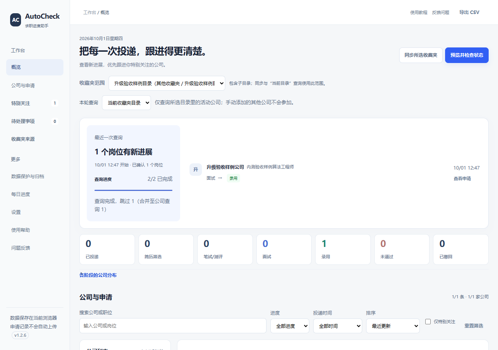
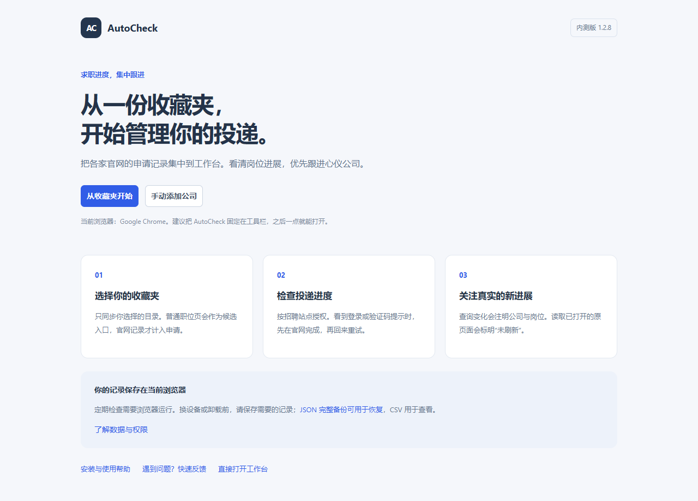

# AutoCheck

**把分散在招聘网站上的申请进度，整理到一个清晰的本地工作台。**

Edge / Chrome · 公司特别关注 · 查询变化 · 本地记录

[下载安装](https://github.com/USING-A/AutoCheck-releases/releases) · [使用帮助](HELP.md) · [反馈问题](https://github.com/USING-A/AutoCheck-releases/issues)

---

AutoCheck 从你指定的收藏夹识别招聘入口，汇总能够可靠解析的投递记录。无需 AutoCheck 账号，记录保存在当前浏览器。

*实际 Edge 扩展操作截图，来自 1.2.6 隔离测试；公司与岗位为合成示例，不含真实求职信息。*

| 你想做什么 | 从哪里开始 |
| --- | --- |
| 集中查看投递进度 | 选择收藏夹，同步招聘入口，再查询 |
| 优先跟进心仪公司 | 点击公司星标，特别关注优先展示 |
| 看本次有什么变化 | 查看工作台上方的公司、岗位与进度更新 |
| 处理登录或不确定结果 | 根据“需要处理”提示去官网核对 |
| 保存与恢复记录 | 在“数据与权限”下载完整 JSON |
| 反馈查询差异 | 检查反馈文稿后复制、下载或打开 GitHub |

## 三步开始

1. 在[发行页](https://github.com/USING-A/AutoCheck-releases/releases)下载 `autocheck-1.2.9-beta.zip`，解压到固定位置。
2. Edge 打开 `edge://extensions`，Chrome 打开 `chrome://extensions`。开启“开发者模式”，选择“加载解压缩的扩展”，选中本包直接包含 `manifest.json` 的 `extension` 文件夹。
3. 固定并打开 AutoCheck，从欢迎页选择收藏夹或手动添加，然后按照工作台提示完成首次查询。

日常使用不需要开发环境或源码仓库权限。完整步骤、更新方法与常见问题见[使用帮助](HELP.md)。

*1.2.8 原包在隔离 Chrome 中调试加载后的真实截图；手动加载与首次授权由用户完成。*

## 更新与备份

先在“数据与权限”下载完整 JSON。覆盖原来的 `extension` 文件夹，在扩展管理页点击“重新加载”，再刷新工作台。保持相同目录，不先卸载；更换目录或改为商店安装可能产生新的扩展身份。

JSON 可用于完整恢复，恢复前请核对覆盖预览。CSV 用于查看表格。登录、收藏夹选择和网站授权不会随备份转移。

## 反馈与帮助

从 AutoCheck 的“问题反馈”检查脱敏预览，再选择一键复制、下载文稿或打开 [GitHub 问题页](https://github.com/USING-A/AutoCheck-releases/issues)。打开页面不会自动替你提交。

提交 Issue 需要 GitHub 账号，内容公开可见。请移除姓名、账号、完整招聘网址、Cookie、验证码、简历、完整备份和未打码截图；说明网站时只提供域名。没有 GitHub 账号时，可把已检查的文稿交给内测联系人。

## 内测范围

当前为 **1.2.9 内测版**，采用手动加载。网站改版、登录状态及不同企业页面可能影响识别，重要状态请到官网核对；支持平台不等于其全部企业已验证。

本仓库提供封装发行、帮助与反馈，开发源码单独保留。浏览器商店发行尚未完成。
